<script src="https://karttur.github.io/common/assets/js/karttur/togglediv.js"></script>

This post is part of a series on organising and analysing data from the Open Soil Spectral Library (OSSL). It is also the first post in a sub-series on how to apply Machine Learning (ML) for predicting soil properties from spectral data.

### Introduction

As the Open Soil Spectral Library (OSSL) contains thousands of individual samples, each with thousands of recorded reflectances in different wavelengths, and additional physical and chemical soil properties, it is a suitable dataset for applying Machine Learning (ML) modelling. This post illustrates the steps to take when applying ML for modelling soil properties from soil spectral data.

### Prerequisites

This post discusses and illustrates the process steps to follow when modelling soil properties from spectral data. The post does not require any installations or other program packages.

### Machine Learning

Machine Learning (ML) includes a range of methods for preparing, refining, selecting, aggregating, evaluating and modelling different dependent, target feature, properties from a set of independent variables (covariates). For the ML modelling of soil properties from spectral data I have built a predefined process-flow structure. The process-flow is governed by a series of connected command file using json syntax.

### Process steps for modelling soil properties from spectra

To build a Machine Learning (ML) model of soil properties from spectral data you need:

1. independently measured soil chemical, physical and/or biological properties, and
2. spectra representing the very same samples as in 1.

Usually spectral soil data is derived from [diffuse reflectance spectroscopy](https://en.wikipedia.org/wiki/Diffuse_reflectance_spectroscopy), sometimes called remission spectroscopy. However, also other spectroscopy methods can be used for analysing soils, including [X-Ray Fluorescence spectroscopy](https://en.wikipedia.org/wiki/X-ray_fluorescence), [Ultra-Violet (UV) fluorescence spectroscopy](https://en.wikipedia.org/wiki/Fluorescence_spectroscopy) and [Raman spectroscopy](https://en.wikipedia.org/wiki/Raman_spectroscopy). The OSSL spectral data is derived from Near InfraRed (NIR) diffuse reflectance spectroscopy in the wavelength region 350 to 2500 nano metres (nm).

The process steps implemented in the Python based program used in the blog include:

<ol>
  <li>Target feature preprocessing</li>
<ul>
    <li>mathematical transformation</li>
</ul>
<li>Spectral signal preprocessing</li>
<ul>
    <li>spectral signal filtering/multifiltering</li>
    <li>spectral signal extraction</li>
</ul>
<li>Collation of target feature and spectral datasets</li>
<ul>
  <li>NoData cleaning</li>
</ul>
<li>splitting collated DataFrame in train and test datasets</li>
<li>spectral data information enhancement
    <ul>
        <li>scatter correction</li>
        <li>scaling/standardisation</li>
        <li>derivation</li>
        <li>decomposition</li>
    </ul>
</li>
<li>outlier detection and removal (training dataset only)</li>
<li>general covariate selection (unrelated to target feature/regressor)
  <ul>
      <li>variance threshold selector</li>
      <li>band agglomeration</li>
  </ul>
</li>
<li>specific covariate selection (related to target feature/regressor)
<ul>
    <li>Univaraite selector</li>
    <li>Permutation selector</li>
    <li>Recursive Feature Elimination (RFE)</li>
</ul>
</li>
<li>Modelling</li>
  <ul>
    <li>model formulation
    <ul> <li>Hyper parameter tuning</li>
    </ul>
    </li>
    <li>model validation</li>
  </ul>
</ol>

If step 5 (spectral data information enhancement) is applied, the enhancement(s) are developed from predefined arguments and the training data, and then implemented using the variable settings derived from the training dataset to all subsequent tests and predictions. Step 6 is only applied during the model training and removes extreme samples (it does not affect the number of covariates). Steps 6 and 7 use different approach for reducing the number covariates during model training, only the surviving covariates are used in the model formulation and thus also in subsequent model training or predictions.

Only step 3 is compulsory. But unless at least one more step is included, the operation does not lead to any useful results. You do not, however, need to include step 9, Modelling. You can use the process flow for testing the effects of different spectral signal filtering/extraction, covariate information enhancement or feature selection. These will all result in statistical evaluations of covariate importances. If you include modelling, also model performances will be statistically evaluated.

The process steps are illustrated in Figure 1.

<figure>
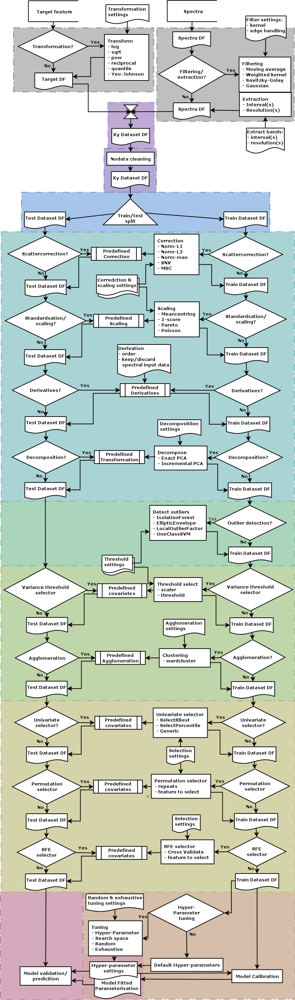
<figcaption>Figure 1. Sequence of process steps for modelling soil properties from spectral data as implemented in the xSpectre python ML-model environment.</figcaption>
</figure>

#### Target feature preprocessing

<figure>
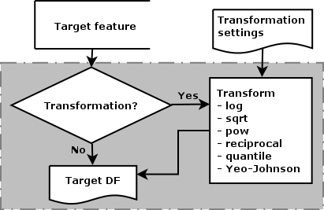
<figcaption>Figure 2. Target feature transformation options for modelling soil properties from spectral data in the xSpectre python ML-model environment.</figcaption>
</figure>
The first step in the process flow, _target feature mathematical transformation_, is the only step that directly affects the target feature (figure 2). The transformation options available include:

- logarithmic (ln),
- square root (sqrt),
- power (pow),
- reciprocal (reciprocal),
- quantile (quantile), and
- [Yeo-Johnsson (Yeo-Johnsson)](https://scikit-learn.org/stable/modules/generated/sklearn.preprocessing.PowerTransformer.html).

The [Yeo-Johnson power transformation](https://scikit-learn.org/stable/modules/generated/sklearn.preprocessing.PowerTransformer.html) is an extension of the older Box-Cox transformation, where Yeo-Johnson can handle both positive and negative values for the target feature.

The arguments for the target feature transformations are in a separate json file ("_targetfeaturetransforms_"), linked via the json specification file:

```
{
  "rootpath": "/path/to/OSSL/Sweden/LUCAS",
  "sourcedatafolder": "data",
  "arrangeddatafolder": "arranged-data",
  "jsonfolder": "json-ml-modeling",
  "projFN": [
    "ml-model.json"
  ],
  "targetfeaturesymbols": "/path/to/targetfeaturesymbols.json",
  "targetfeaturetransforms": "/path/to/targetfeaturetransforms.json",
  "createjsonparams": false
}
```

In the json file defining the target feature transformations, each target feature must be stated and all options listed:

```
{
  "targetFeatureTransform": {
    "target_feature_1": {
      "log": false,
      "sqrt": false,
      "pow": 0,
      "reciprocal": false,
      "quantile": false,
      "yeojohnson": false  
    },
    "target_feature_2": {
      "log": false,
      "sqrt": false,
      "pow": 2,
      "reciprocal": false,
      "quantile": false,
      "yeojohnson": false  
    },
    "target_feature_3": {
      "log": true,
      "sqrt": false,
      ...
    ...
```

If all options are set to _false_ (or _0_) (= default), no transformation is performed.

#### Spectral signal preprocessing

<figure>
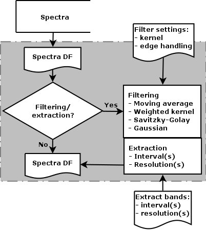
<figcaption>Figure 3. Spectral signal preprocessing includes two sub-steps: filtering/multifiltering and extraction. These do not depend on each other; the user can select to run both or just one of them, or none.</figcaption>
</figure>

Spectral signals have errors and biases that relate back to small variations in optical, opto-electronic and electronic components, temperature and moisture conditions and minimal difference in sample positioning and preparations. Many spectral signals also encompass thousands of wavelengths (or bands). Filtering the spectral signal and either reducing the spectral resolution or selecting particular band regions can sometimes improve the modelling of properties from spectral data.

##### Filtering and extraction

As filtering and band extraction are not reliant on anything else than individual spectral signals, the process step is performed on the spectral signals before both the collation of the complete dataset and the splitting into training and test datasets.

Extraction is integrated into the filter process. If you only want to extract (without filtering) set all filter options to false (empty or null as explained below).

Four types of filters are included in the process flow (the links lead to the Sci-kit learn functions applied in the script):

- [moving average](https://docs.scipy.org/doc/scipy/reference/generated/scipy.ndimage.convolve1d.html),
- [kernel](https://docs.scipy.org/doc/scipy/reference/generated/scipy.ndimage.convolve1d.html),
- [Gaussian](https://docs.scipy.org/doc/scipy/reference/generated/scipy.ndimage.gaussian_filter1d.html), and
- [Savitzky-Golay](https://docs.scipy.org/doc/scipy/reference/generated/scipy.signal.savgol_filter.html)

The moving average is actually just a special case of the kernel filter (with all cells in the kernel set to unity). The kernel must be an un-even number array and an empty array is interpreted as _apply_ = _false_) but can be any size. The values are always normalised so that the array sum = 1. The Gaussian filter only requires the standard deviation (sigma) value (where _sigma_ = _0_ is interpreted as _apply_ = _false_). Savitzky-Golay requires arguments for _window_length_, _polyorder_ and _deriv_ (where _window_length_ = _0_ is interpreted as _apply_ = _false_). The filtering of the edges of each spectrum is defined with the argument _mode_. In this example the Filtering step will perform a Gaussian filter with sigma set to 2.5:

```
  "filtering": {
    "apply": true,
    "beginWaveLength": 550,
    "endWaveLength": 1100,
    "movingaverage": {
      "kernel": [],
      "mode": "nearest"
    },
    "Gauss": {
      "sigma": 2.5,
      "mode": "nearest"
    },
    "SavitzkyGolay": {
      "window_length": 0,
      "polyorder": 2,
      "deriv": 0,
      "mode": "nearest"
    }
  }
```

##### Multiiltering

The process flow also includes a _multifiltering_ option, which is an extension of  _fitlering_ allowing different band (wavelengths) regions to be filtered and extracted separately. This is useful when for instance emulating the (theoretical) performance of simpler sensors with lower spectral range and resolution compared to the spectral signal at hand. Most simpler (usually filter based) sensors have relatively few bands (up to 64 or 128), with each band having a precisely defined Full Width at Half Maximum (FWHM). FWHM is an alternative manner in describing a normal (i.e. Gaussian) distribution. There is thus a direct relation between FWHM and standard deviation, such that:
```
FWHM = 2.355 * sigma
```
```
\text{FWHM} \approx 2.355\cdot \sigma.
FWHM ~ 2.355 SD
```
As an example, the AMS-OSRAM spectral sensor [AS7263](https://ams.com/as7263) is a 6 band spectral sensor with the following characteristics:

_Table 1. Spectral characteristics of the AMS-OSRAM spectral sensor AS7263_

| Central wavelength | FWHM | sigma |
| 610 | 20 | 47 |
| 680 | 20 | 47 |
| 730 | 20 | 47 |
| 760 | 20 | 47 |
| 810 | 20 | 47 |
| 860 | 20 | 47 |

To reproduce these characteristics from a higher resolution sensor the _multifiltering_ options are set as shown here:

```
"multifiltering":{
  "apply":true,
  "mode":"noendpoints",
  "beginWaveLength":[560,630,680,710,760,810],
  "endWaveLength":[660,730,780,810,860,910],
  "outputBandWidth":[50,50,50,50,50,50],
  "movingaverage":{"kernel":[[],[],[],[],[],[]]},
  "SavitzkyGolay":{"window_length":[0,0,0,0,0,0]},
  "Gauss":{"sigma":[47,47,47,47,47,47]}
}
```

The only difference vis-a-vis the (single) _filtering_ function is that all arguments are given as arrays. For _multifiltering_ you do not give any _mode_ arguments for the individual filter options, instead the _mode_ given as the (single) _filtering_ argument will be used.

#### Collation of target feature and spectral datasets

<figure>
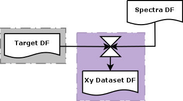
<figcaption>Figure 3. Collation of target feature and spectral covariates for modelling soil properties from spectral data in the xSpectre python model environment.</figcaption>
</figure>

With the target feature transformed (or not), and the spectra filtered and extracted (or not) the next step in the process flow is to collate these datasets into a common [Pandas DataFrame (DF)](https://pandas.pydata.org/docs/reference/frame.html) (figure 3). The present version of the process flow (April 2024) expects the rows in the both datasets to represent the same sample and with no sample missing in either dataset.

The collation step is always performed and requires no arguments.

##### NoData cleaning

<figure>
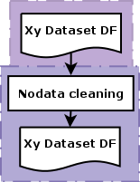
<figcaption>Figure 4. NoData cleaning process step.</figcaption>
</figure>

The collated dataset is automatically controlled for NoData (NaN) entries, and all NoData samples are deleted from the DataFrame.

#### Splitting collated DataFrame in train and test datasets

<figure>
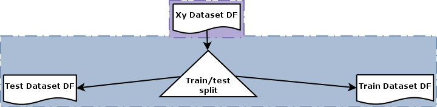
<figcaption>Figure 5. Splitting the DataFrame in training and testing datasets is an obligatory process step.</figcaption>
</figure>

Also the DataFrame split in training and test DFs is an inescapable process step. As a user you can set the fraction of the DF records to be used for training respective testing in the further processing. The default is to use 70% for training and 30 % for validation. In the present version it is not possible to use Cross Validate (CV) folds for evaluating model performance. Parameterisation code:

```
"modelTests": {
    "apply": true,
    "trainTest": {
      "apply": true,
      "testSize": 0.3
    }
```

#### Spectral data information enhancement

<figure>
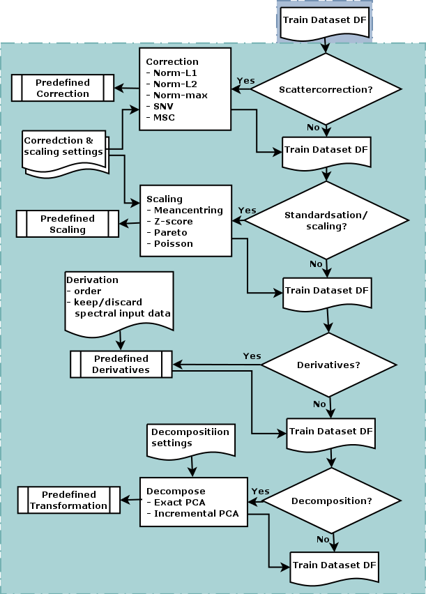
<figcaption>Figure 5. Spectral data preprocessing steps available in the xSpectre process flow.</figcaption>
</figure>

The spectral data information enhancement steps are specifically built for massaging _spectral_ data to reveal more information and less noise. The methods listed in this section are thus primarily applicable for spectral data and other smooth and correlated multidimensional data, but not necessarily useful for preparing other types of covariates.

The preparation of spectral data requires special consideration. Spectral data can be biased due to several different causes, including variations in temperature, light source, distance and geometry between light source, sample and spectral sensor, atmospheric conditions in the air space the electromagnetic signal has to pass, variation in matrix material (e.g. structural differences in solid materials, purity of liquids etc). The spectral data preparation options available in the xSpectre process flow include:

- scatter correction,
- standardisation (scaling),
- derivation, and
- decomposition.

##### Scatter correction

Scattering effects occur because of variations in specular (mirror like) reflectances, variations in the sample matrix material particle sizes and the path length of the emitted and reflected light from its source via the sample to the sensor. These effects can be additive or multiplicative and distorts the individual spectra even if derived from the same instrument.

Scatter correction is a widely applied technology for reducing scatter effects while retaining the information related to mainly chemical composition properties. For a deeper discussion see the online article [Two scatter correction techniques for NIR spectroscopy in Python](https://nirpyresearch.com/two-scatter-correction-techniques-nir-spectroscopy-python/), that I also used for scripting the SNV and MSC methods in the process flow.

The process flow includes 5 different methods for scatter correction:

- [norm-L1](https://scikit-learn.org/stable/modules/generated/sklearn.preprocessing.normalize.html),
- [norm-L2](https://scikit-learn.org/stable/modules/generated/sklearn.preprocessing.normalize.html),
- [norm-max](https://scikit-learn.org/stable/modules/generated/sklearn.preprocessing.normalize.html),
- [Standard Normal Variate (SNV)](https://nirpyresearch.com/two-scatter-correction-techniques-nir-spectroscopy-python/), and
- [Multiplicative Scatter Correction (MSC)](https://nirpyresearch.com/two-scatter-correction-techniques-nir-spectroscopy-python/).

_norm-L1_ is a length (linear) defined normalisation, _norm-L2_ is area (square) defined and _norm-max_ forces the maximum value of each spectra to have the same numerical value.
[MORE ON SNV AND MSC]
The main difference between SNV and MSC is that MSC can use a pre-defined average spectrum derived from an ensemble of spectra. This means that applying MSC for model testing requires the mean spectral signal from the training data. The other methods only use single spectrum properties for the scatter correction and do not require any additional information.

In some circumstances it can be advantageous to execute two scatter corrections in sequence, with the second using the output from the first as input. The second should rather be either SNV or MSC, whereas the first can be any of the five (including SNV or MSC), as in this example of the scatter correction arguments:

```
  "scattercorrection": {
    "apply": true,
    "scaler": [
      "snv",
      "snv"
    ]
  },
```

##### Standardisation (normalized scaling)

Standardisation, or normalized scaling, can both improve the information content and reduce noise. The techniques that can be applied as part of the process flow include:

- [meancentring](https://www.quora.com/In-regression-what-is-centering-on-the-mean-Can-you-explain-describe-it),
- [autoscaling (standard score or z-score normalisation)](https://en.wikipedia.org/wiki/Standard_score),
- [Paretoscaling](https://wiki.eigenvector.com/index.php?title=Advanced_Preprocessing:_Variable_Scaling), and
- [Poissonscaling](https://wiki.eigenvector.com/index.php?title=Advanced_Preprocessing:_Variable_Scaling).

**Meancentring** subtracts the average from all the values, forces a mean of zero and thus levels any offset. In many cases this increases the information content in spectral data. As meancentring have few, or any, negative impacts it is usually applied as a robust methods for increasing information in spectral data.

**Autoscaling** is perhaps the most common preprocessing method; it uses meancentring followed by division with the standard deviation. The result is a mean of zero with a standard deviation of one (1) also having a numerical value of one (1). Autoscaling is a sound approach if the signal to noise ratio is high. However, if the signal to noise ratio is low, or the standard deviation is near zero, autoscaling causes noise to dominate over the signal - this is not uncommon for spectral data. Autoscaling is thus in general not recommended to use as a preprocess for spectral data.

While meancentring can improve information by removing the offset, it does not support capturing information from smaller peaks in the data. That is usually accomplished by autoscaling. But as noted in the previous paragraph, for spectral data auto scaling primarily causes the noise to increase. Enters the two alternative methods of Pareto and Poisson scaling.

**Pareto scaling** scales each variable by the square root of the standard deviation without applying any prior meancentring. **Poisson scaling** (also known as square root mean scaling or "sqrt mean scale") scales each variable by the square root of the mean without applying any prior meancentring. An offset is sometimes used for adjusting variables with near-zero values as part of the Poisson scaling. This is not implemented in the present version of the  process-flow.

In the json command file all 4 scaling options are stated, with meancentring set to _true_ by default. To apply any other scaling function, set _meancentring_ to _false_ and the scaling function you want to apply to _true_. If all options are set to _false_, or _apply_ is set to _false_, the covariates will not be standardised.

```
  },
  "standardisation": {
    "apply": true,
    "meancentring": true,
    "autoscaling": false
    "paretoscaling": true,
    "poissonscaling": false,  
  },
```

##### Derivation

In many cases the signal derived from derivates carries more informationen than the spectral signal itself. In the process flow you set the n:th derivative to extract and whether or not to keep or discard the original spectral signal in the subsequent steps. To invoke derivation you ave to set _apply_ to _true_ and derive to the n:th derivate you want to retrieve (_derive_ set _0_ equals the original data). If _join_ is set to _true_, the derivatives will be joined as new covariates, if set to _false_ the derivates will replace the existing covariates.

```
"derivatives": {
    "apply": false,
    "derive": 0,
    "join": false
  }
```


##### Decomposition

The process flow decomposition only include Principal Component Analysis (PCA). The only argument required is the number of components to calculate and retain as covariates. Components will be generated from all existing input covariates and then replace these covaraites with the components. The covariates will be re-labelled as

```
pc-001, pc-002, pc-003, ...
```
The json command coding for applying decomposition as a pre-process:
```
  "pcaPreproc": {
    "apply": true,
    "n_components": 8
  }
```

#### Outlier detection and removal

<figure>
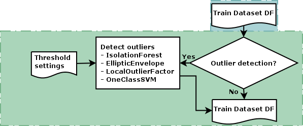
<figcaption>Figure 5. Spectral data preprocessing steps available in the xSpectre process flow.</figcaption>
</figure>

Outlier detection and removal only affects the model training. The purpose of removing outliers from the model training is to reduce the effects of (erroneous) extreme values. This can be critical in small datasets but should have little effect in large datasets without major errors.

The process-flow implements four different outlier detectors (the links lead to the Sci-kit learn functions applied in the script):
- [IsolationForest](https://scikit-learn.org/stable/modules/generated/sklearn.ensemble.IsolationForest.html),
- [EllipticEnvelope](https://scikit-learn.org/stable/modules/generated/sklearn.covariance.EllipticEnvelope.html),
- [LocalOutlierFactor](https://scikit-learn.org/stable/modules/generated/sklearn.neighbors.LocalOutlierFactor.html), and
- [OneClassSVM](https://scikit-learn.org/stable/modules/generated/sklearn.svm.OneClassSVM.html).

In the json command file you turn the function on by the following lines:
```
  "removeOutliers": {
    "apply": true,
    "detector": "LocalOutlierFactor",
    "contamination": 0.1
    },
```

The only parameter that can be changed in the present version is _contamination_ (applying to the parameter _nu_ in the detector _OneClassSVM_).

#### General covariate selection

<figure>
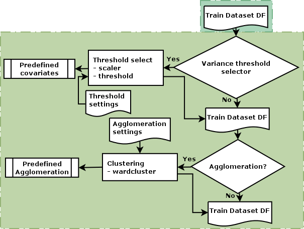
<figcaption>Figure 5. Spectral data preprocessing steps available in the xSpectre process flow.</figcaption>
</figure>

The step encompassing General covariate selection includes 2 generic methods for reducing the number of covariates:

- [variance threshold selector]((https://scikit-learn.org/stable/modules/generated/sklearn.feature_selection.VarianceThreshold.html)), and
- band agglomeration

Neither method requires any information of the target feature or the regressor (thus _general_). The methods result in a reduced set of covariates that will then be used for both model training and testing, and any subsequent prediction.

##### Variance threshold selector

Variance threshold selector applies the sklearn method [VarianceThreshold](https://scikit-learn.org/stable/modules/generated/sklearn.feature_selection.VarianceThreshold.html) and removes all low-variance features with variances below a stated threshold.

To neutralise the range of the input features the sklearn [MinMaxScaler](https://scikit-learn.org/stable/modules/generated/sklearn.preprocessing.MinMaxScaler.html) is always applied as a pre-process. The only parameter that you can set in the process-flow command file is the _threshold_ for retaining or discarding a feature:

[UPDATE FROM global TO general]
```
  "generalFeatureSelection": {
    "apply": true,
    "scaler": "MinMaxScaler",
    "varianceThreshold": {
      "threshold": 0.025
    }
  },
```

##### Band agglomeration

Sci-kit learn includes a range of [clustering methods](https://scikit-learn.org/stable/modules/classes.html#module-sklearn.cluster). In the process flow I have chosen to only include only Ward clustering including an optional automation for selecting an optimal number of clusters.  

To include the Ward clustering in the process-flow, edit the json command file thus:

```
  "featureAgglomeration": {
    "apply": true,
    "wardClustering": {
      "apply": true,
      "n_clusters": 0,
      "affinity": "euclidean",
      "tuneWardClustering": {
        "apply": true,
        "kfolds": 3,
        "clusters": [
          4,
          5,
          6,
          7,
          8,
          9,
          10,
          11,
          12
        ]
      }
    }
  },
```

In the example above I have asked the tuning function to evaluate all optional cluster sizes between 4 and 12, and set the tuning process to a kfold strategy of 3 folds. As the function will seek an optimal number of clusters, I have set the _n_clusers_ parameter for the main _wardClustering_ to _0_. If  _tuneWardClustering_ is not requested, that number must instead be set to the actual number of clusters requested from _wardClustering_.

#### Specific covariate selection

In contrast to the general covariate selection methods, the specific methods identify the most significant covariates in relation to the target feature or the target feature and the regressor. Three different methods are implemented in the process flow:

- [Univariate selector]()
- [Permutation selector](), and
- [Recursive Feature Elimination (RFE)]()

#### Model calibration

<figure>
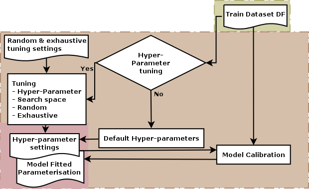
<figcaption>Figure X. Spectral data modeling in the xSpectre process flow.</figcaption>
</figure>

#### Model testing and validation

<figure>
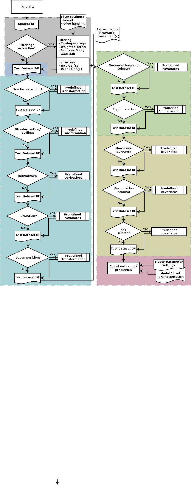
<figcaption>Figure X. Spectral data modeling in the xSpectre process flow.</figcaption>
</figure>

#### Resources

[WEINDORF, David C.; CHAKRABORTY, Somsubhra. Portable X‐ray fluorescence spectrometry analysis of soils. Soil Science Society of America Journal, 2020, 84.5: 1384-1392.](https://acsess.onlinelibrary.wiley.com/doi/abs/10.1002/saj2.20151)

[Python API reference for convolution (kernel) filter](https://docs.scipy.org/doc/scipy/reference/generated/scipy.ndimage.convolve1d.html)

[Python API reference for Savitzky-Golay filter](https://docs.scipy.org/doc/scipy/reference/generated/scipy.signal.savgol_filter.html)

[Python API reference for Gaussian filter](https://docs.scipy.org/doc/scipy/reference/generated/scipy.ndimage.gaussian_filter1d.html)

[Python API reference for standard scaler](https://scikit-learn.org/stable/modules/generated/sklearn.preprocessing.StandardScaler.html)
