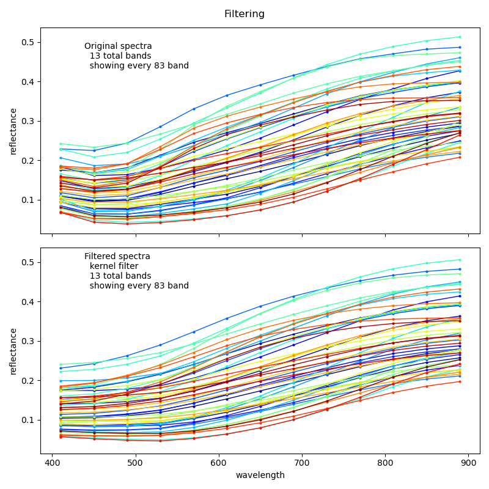
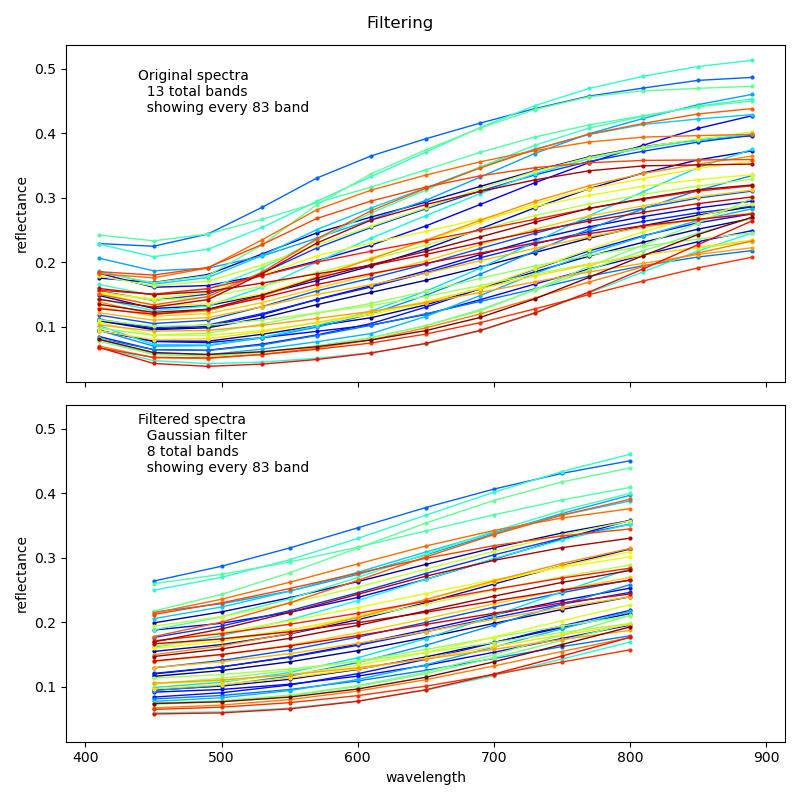
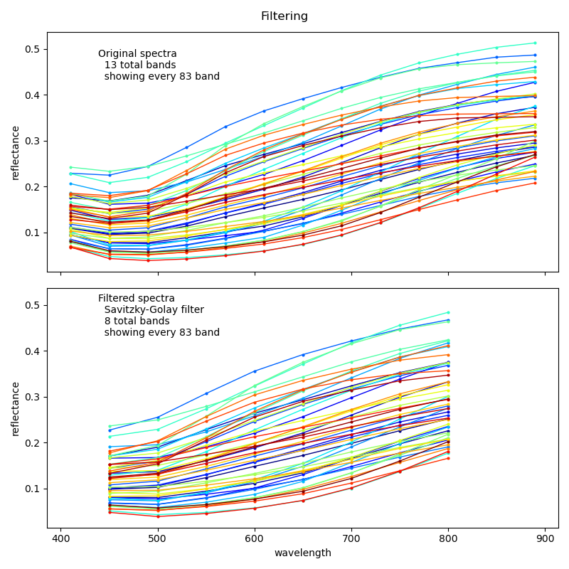
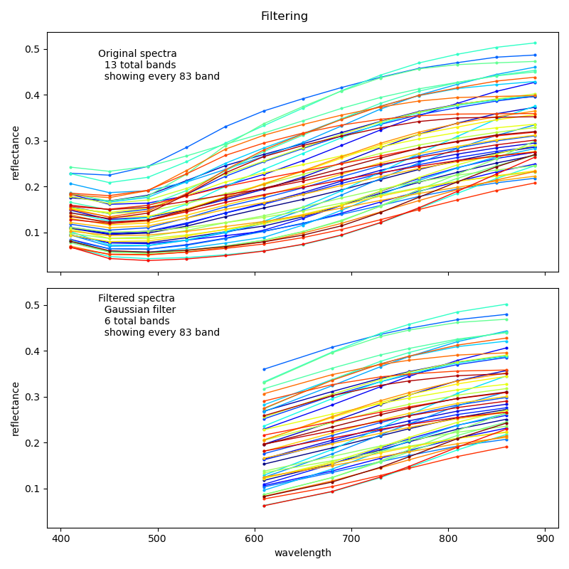

### Introduction

Filtering and extraction of sub-ranges in spectral data can reduce noise, improve model accuracy, decrease computation time and be used to replicate a simpler sensor with a lower spectral resolution and lower range. In the process flow, filtering can be applied using either a single filter applied to the full spectrum, or as multiple filters over different ranges. The latter is especially useful for replicating simpler sensors with uneven distribution of the captured spectral signal.

The following 4 filters are included in the process flow:

- [moving average](https://docs.scipy.org/doc/scipy/reference/generated/scipy.ndimage.convolve1d.html),
- [kernel](https://docs.scipy.org/doc/scipy/reference/generated/scipy.ndimage.convolve1d.html),
- [Gaussian](https://docs.scipy.org/doc/scipy/reference/generated/scipy.ndimage.gaussian_filter1d.html), and
- [Savitzky-Golay](https://docs.scipy.org/doc/scipy/reference/generated/scipy.signal.savgol_filter.html)

The moving average is actually just a special case of the kernel filter (with all cells in the kernel set to unity). The kernel must be an un-even number array and an empty array is interpreted as _apply_ = _false_) but can be any size. The values are always normalised so that the array sum = 1. The Gaussian filter only requires the standard deviation (sigma) value (where _sigma_ = _0_ is interpreted as _apply_ = _false_). Savitzky-Golay requires arguments for _window_length_, _polyorder_ and _deriv_ (where _window_length_ = _0_ is interpreted as _apply_ = _false_). The filtering of the edges of each spectrum is defined with the argument _mode_.

An important issue is that moving average, customised kernel and Savitzky-Golay are set without reference to the spectral resolution. They simply operate on the series of data disregarding the physical separation between each recording. In the implementation of the Gaussian filter, the sigma (standard deviation), however, refers to the actual physical standard deviation in nanometer (nm).

#### Moving average

The moving average and customised kernel methods are both defined as convolution filters and defined by an array of weights. It is the primary filter option and if an array is given it will be applied. To skip the convolution filter for another option simple leave the array empty. The example below shows a moving filter averages 5 adjacent values to set the central value - the result is illustrated in figure 1.

```
"spectraPreProcess": {
    "filtering": {
      "apply": true,
      "extraction": {
        "mode": "endpoints",
        "outputBandWidth": 25,
        "beginWaveLength": 0,
        "endWaveLength": 0
      },
      "movingaverage": {
        "kernel": [1,1,1,1,1],
        "mode": "nearest"
      },
      "Gauss": {},
      "SavitzkyGolay": {}
    }
```

#### Customised kernel

See text for Moving average in the previous section and figure 1 to see the results of applying the kernel in the example below.

```
"spectraPreProcess": {
    "filtering": {
      "apply": true,
      "extraction": {
        "mode": "endpoints",
        "outputBandWidth": 25,
        "beginWaveLength": 0,
        "endWaveLength": 0
      },
      "movingaverage": {
        "kernel": [1,2,4,2,1],
        "mode": "nearest"
      },
      "Gauss": {},
      "SavitzkyGolay": {}
    }
```
#### Gaussian filter

To apply a Gaussian filter set an empty kernel for Moving average as described above. If the sigma (standard deviation) of the Gaussian filter is set to zero (0) it will be skipped.

For the spectral filtering the standard deviation should be set in nanometers. It is then recalculated to fit the spectral resolution of the input data. In the example, sigma is set to 150, and the filter output illustrated in figure 1.

```
"spectraPreProcess": {
    "filtering": {
      "apply": true,
      "extraction": {
        "mode": "endpoints",
        "outputBandWidth": 25,
        "beginWaveLength": 0,
        "endWaveLength": 0
      },
      "movingaverage": {
        "kernel": []
      },
      "Gauss": {
        "sigma": 150,
        "mode": "nearest"
      },
      "SavitzkyGolay": {}
    }
```

#### Savitzky-Golay filter

In Savitzky-Golay filtering a polynominal is fitted to each point using a window. The result of applying a Savitzky-Golay filter as defined below is illustrated in figure 1.

```
"spectraPreProcess": {
    "filtering": {
      "apply": true,
      "extraction": {
        "mode": "endpoints",
        "outputBandWidth": 25,
        "beginWaveLength": 0,
        "endWaveLength": 0
      },
      "movingaverage": {
        "kernel": []
      },
      "Gauss": {
        "sigma": 0
      },
      "SavitzkyGolay": {
        "window_length": 5,
        "polyorder": 2,
        "mode": "nearest"
      }
    }
```

#### Illustration

<figure class="half">

<a href="../../images/spectromodel_filtering_moving-average.png"></a>

<a href="../../images/spectromodel_filtering_customised-kernel.png"></a>

<a href="../../images/spectromodel_filtering_gauss.png"></a>

<a href="../../images/spectromodel_filtering_savitzky-golay.png"></a>

<figcaption>Figure 1. Filtering methods included in the process flow; top row: moving average and customised kernel, bottom row: Gaussian and Savitzky-Golay filters.</figcaption>
</figure>

#### Multifiltering

To apply multifilter the normal filtering must be turned off (_apply_ set to _false_). The principle for defining filter is similar as for single filters, but written inside an array (list) for each individual filter. You can thus apply different methods for different ranges. The example below shows the filter for extracting the theoretical spectral coverage by the AMS [AS7263](https://ams.com/as7263) 6 band spectral sensor, also mentioned in the post on [process-flow illustration](../../spectrodata(spectrodata-OSSL4ML04-mlmodel00/)).

The outcome of applying the multifilter below is illustrated in Figure 2.

```
"multifiltering": {
      "apply": true,
      "beginWaveLength": [
        560,
        630,
        680,
        710,
        760,
        810
      ],
      "endWaveLength": [
        660,
        730,
        780,
        810,
        860,
        910
      ],
      "outputBandWidth": [
        50,
        50,
        50,
        50,
        50,
        50
      ],
      "movingaverage": {
        "kernel": [
          [],
          [],
          [],
          [],
          [],
          []
        ]
      },
      "SavitzkyGolay": {
        "window_length": [
          0,
          0,
          0,
          0,
          0,
          0
        ]
      },
      "Gauss": {
        "sigma": [
          47,
          47,
          47,
          47,
          47,
          47
        ]
      }
    }
```

<figure>

<a href="../../images/spectromodel_mulitfiltering_gaussian.png"></a>

<figcaption>Figure 2. Multi-filtering using Gaussian filter for emulating a simpler sensor - note how the output is unevenly spaced.</figcaption>
</figure>
