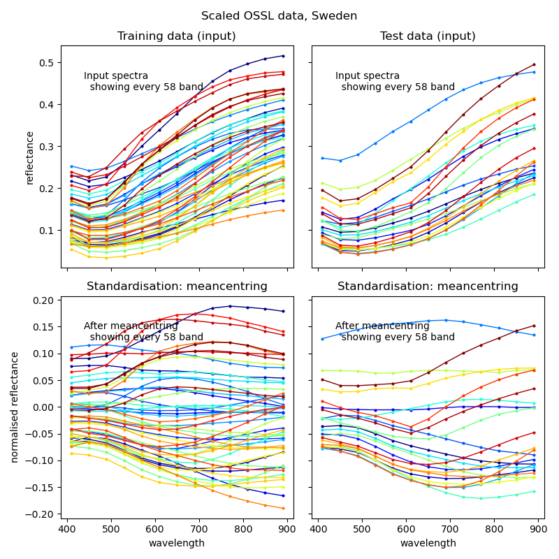
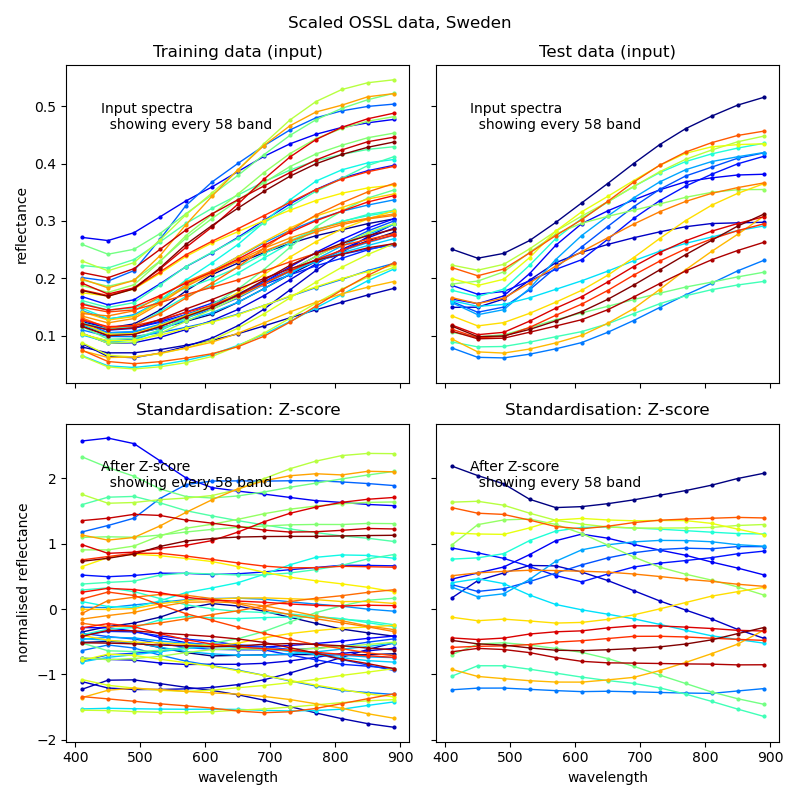
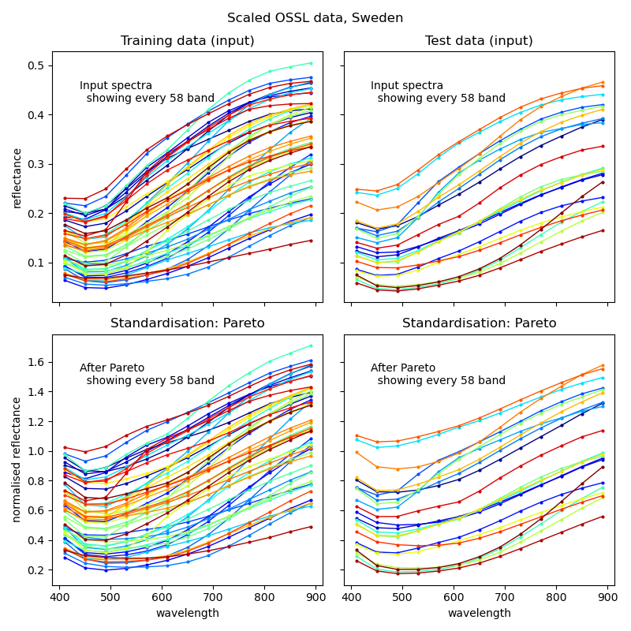
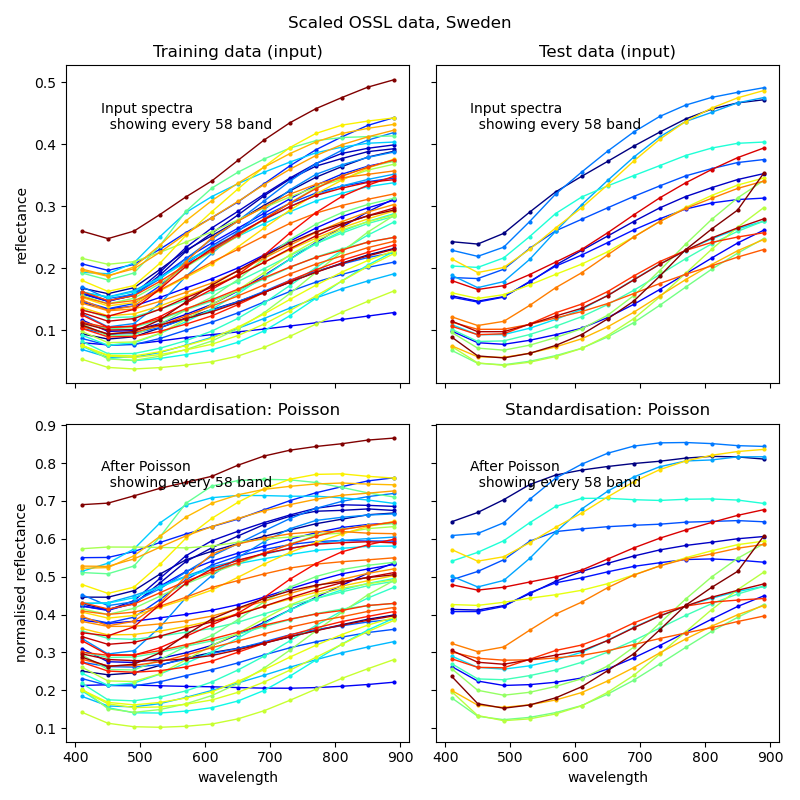

### Introduction

Standardisation, or normalised scaling, can both improve the information content and reduce noise. Standardisation is applied across spectra, scaling each recorded wavelength across a set of spectral signals. The functions that can be applied as part of the process flow include:

- [meancentring](https://www.quora.com/In-regression-what-is-centering-on-the-mean-Can-you-explain-describe-it),
- [autoscaling (standard score or z-score normalisation)](https://en.wikipedia.org/wiki/Standard_score),
- [paretoscaling](https://wiki.eigenvector.com/index.php?title=Advanced_Preprocessing:_Variable_Scaling), and
- [poissonscaling](https://wiki.eigenvector.com/index.php?title=Advanced_Preprocessing:_Variable_Scaling).

#### Meancentring

Meancentring subtracts the average from all the values, forces a mean of zero and thus levels any offset. In many cases this increases the information content in spectral data. As meancentring have few, or any, negative impacts it is usually applied as a robust methods for increasing information in spectral data.

The example below shows how to define a meancentred scaling in the process flow - the result is illustrated in figure 1.

```
  "spectraInfoEnhancement": {
    "apply": true,
    "standardisation": {
      "apply": true,
      "paretoscaling": false,
      "poissonscaling": false,
      "meancentring": true,
      "unitscaling": false
    },
  }
```

#### Autoscaling

Autoscaling (standard score or z-score normalisation) is perhaps the most common preprocessing method; it uses meancentring followed by division with the standard deviation. The result is a mean of zero with a standard deviation of one (1) also having a numerical value of one (1). Autoscaling is a sound approach if the signal to noise ratio is high. However, if the signal to noise ratio is low, or the standard deviation is near zero, autoscaling causes noise to dominate over the signal - this is not uncommon for spectral data. Autoscaling is thus in general not recommended to use as a preprocess for spectral data.

The example below shows how to define autoscaling in the process flow - the result is illustrated in figure 1.

```
  "spectraInfoEnhancement": {
    "apply": true,
    "standardisation": {
      "apply": true,
      "paretoscaling": false,
      "poissonscaling": false,
      "meancentring": true,
      "unitscaling": true
    },
  }
```

#### Pareto scaling

Pareto scaling can be applied as a means for enhancing smaller true peaks/troughs in the spectral signal while suppressing noise. The method scales each variable by the square root of the standard deviation without applying any prior meancentring.

The example below shows how to define Pareto scaling in the process flow - the result is illustrated in figure 1.

```
"spectraInfoEnhancement": {
  "apply": true,
  "standardisation": {
    "apply": true,
    "paretoscaling": true,
    "poissonscaling": false,
    "meancentring": false,
    "unitscaling": false
  },
}
```

#### Poisson scaling

Poisson scaling (also known as square root mean scaling or "sqrt mean scale") is an alterantive to Pareto scaling for enhancing smaller true peaks/troughs while keeping doen the noise. The method sscales each variable by the square root of the mean without applying any prior meancentring. An offset is sometimes used for adjusting variables with near-zero values as part of the Poisson scaling. This is not implemented in the present version of the  process-flow.

The example below shows how to define Poisson scaling in the process flow - the result is illustrated in figure 1.

```
"spectraInfoEnhancement": {
  "apply": true,
  "standardisation": {
    "apply": true,
    "paretoscaling": false,
    "poissonscaling": true,
    "meancentring": false,
    "unitscaling": false
  },
}
```

#### Illustration

Figure 1 illustrates 4 different standardisation functions for enhancing information content in spectral data, all available as part of the process flow.

<figure class="half">

<a href="../../images/spectromodel_standardisation_meancentring.png"></a>

<a href="../../images/spectromodel_standardisation_autoscaling.png"></a>

<a href="../../images/spectromodel_standardisation_paretoscaling.png"></a>

<a href="../../images/spectromodel_standardisation_poissonscaling.png"></a>

<figcaption>Figure 1. Standardisation methods included in the process flow; top row: meancentring and autoscaling, bottom row: Pareto and Poisson scaling.</figcaption>
</figure>
