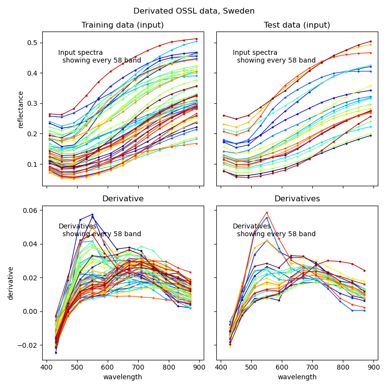
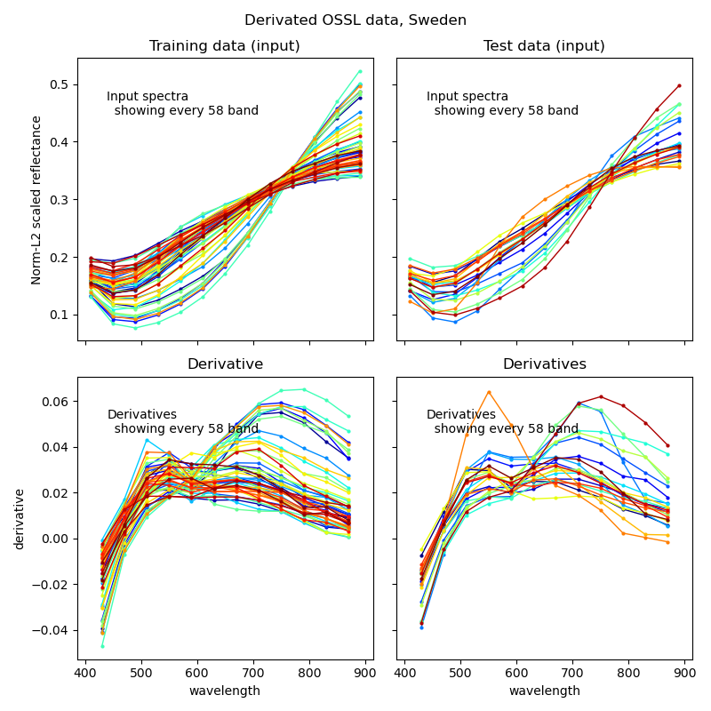

### Introduction

In many cases the signal derived from derivates carries more information than the spectra itself. In the process flow you can extract the first derivative and either keep or discard the original spectral signal in the subsequent steps. To invoke derivation you have to set _apply_ to _true_ and _derive_ to the n:th derivate (at present only the first derivative is supported) you want to retrieve (_derive_ set _0_ equals the original data). If _join_ is set to _true_, the derivatives will be joined as new covariates, if set to _false_ the derivates will replace the existing covariates. At present the process flow only supports retrieving the first derivative.

```
  "spectraInfoEnhancement": {
    "apply": true,
    "derivatives": {
        "apply": true,
        "derive": 1,
        "join": false
    }
  }
```

Figure 1 illustrates the derivatives retrieved from the original spectral data (left) and the spectral data after L2 normalisation.

<figure class="half">

<a href="../../images/spectromodel_derivatives_orignal-spectra.png"></a>

<a href="../../images/spectromodel_derivatives_norml2-spectra.png"></a>

<figcaption>Figure 1. Derivatives from spectral signals; left: from original spectral signals, and right: after L2 normalisation of the spectral signals.</figcaption>
</figure>
