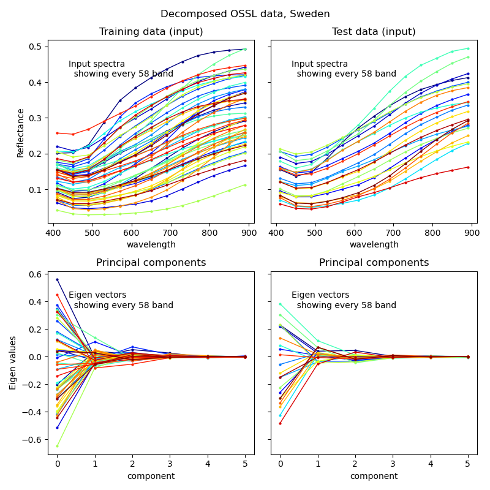
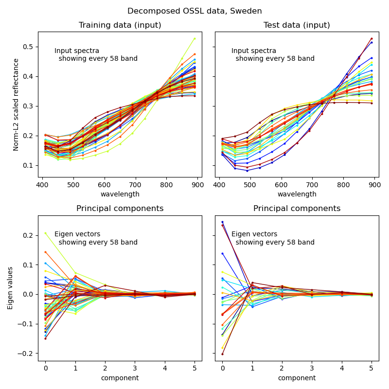
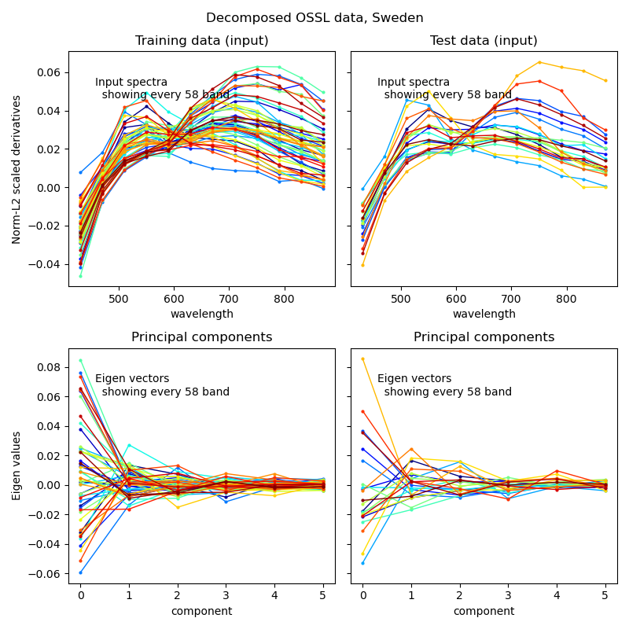

### Introduction

Decomposing multi- and hyperspectral data into fewer bands or variables is oftn an efficient way to both enhance the information content and sped up processing.

he process flow decomposition only include Principal Component Analysis (PCA). The single argument required is the number of components to calculate and retain as covariates. Components will be generated from all existing input covariates and then replace these covaraites with the components.

```
  "spectraInfoEnhancement": {
    "apply": true,
    "pcaPreproc": {
      "apply": true,
      "n_components": 8
    }
  }
```

Figure 1 illustrates decomposition of:

1. original spectral reflectance,
2. L2-normalised spectral reflectance, and,
3. derivatives of L2-normalised spectral reflectance

<figure class="half">

<a href="../../images/spectromodel_pca_reflectance.png"></a>

<a href="../../images/spectromodel_pca_norml2-reflectance.png"></a>

<a href="../../images/spectromodel_pca_norml2-derivatives.png"></a>

<figcaption>Figure 1. Decomposition of spectral signals; upper left: from original spectral signals, upper right: after L2 normalisation of the spectral signals, and lower left after derivation of L2 normalised spectral signals.</figcaption>
</figure>
