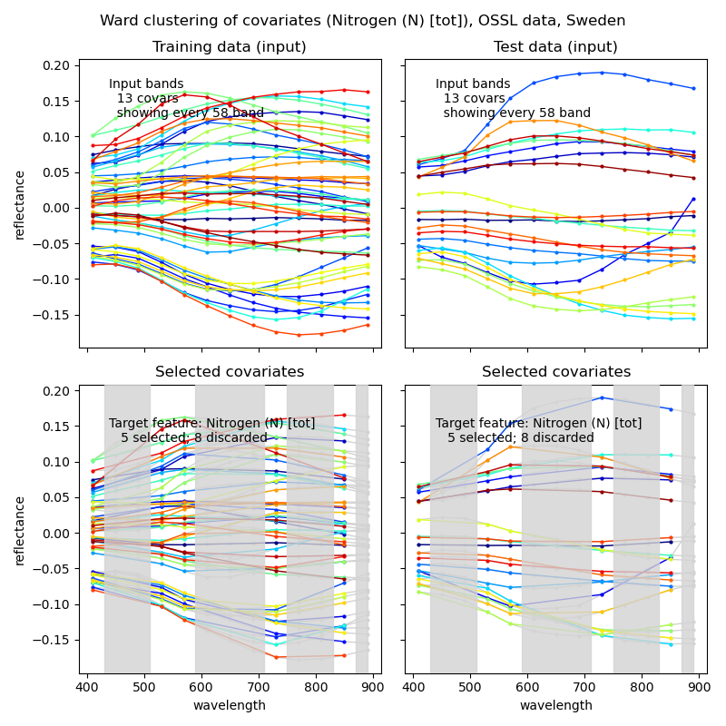
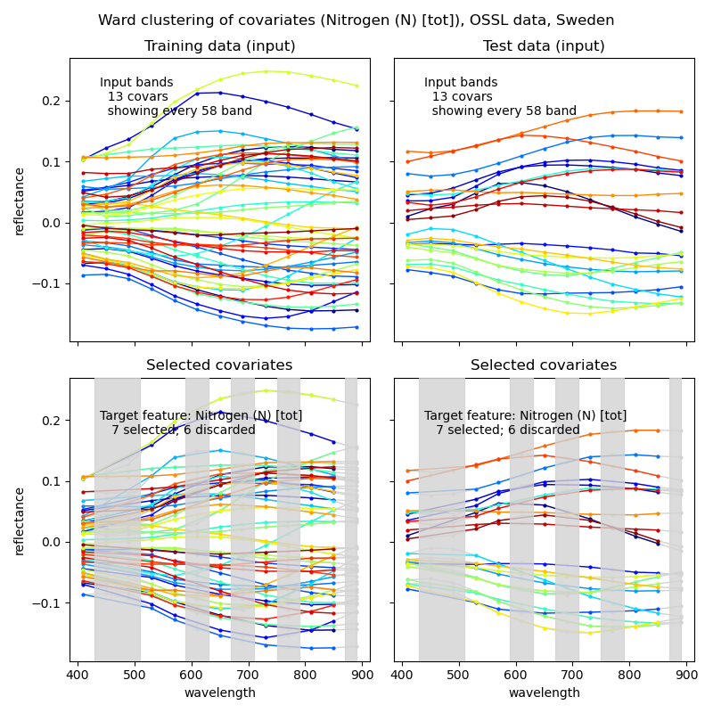
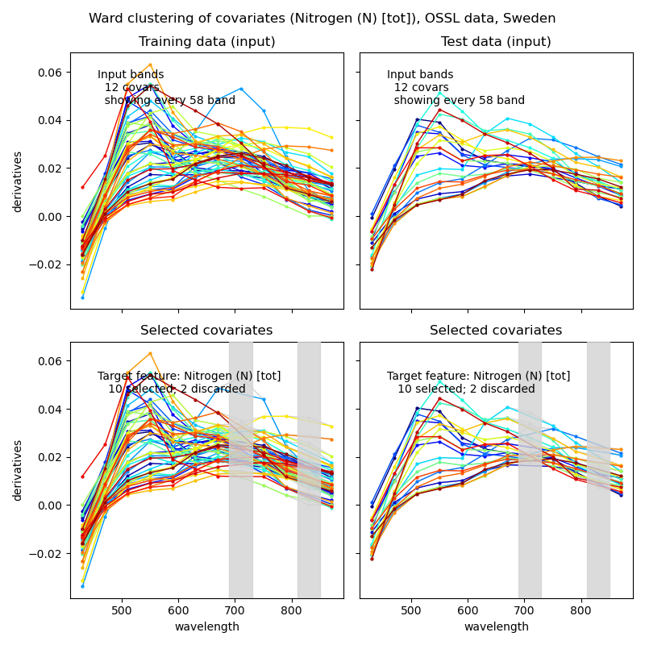
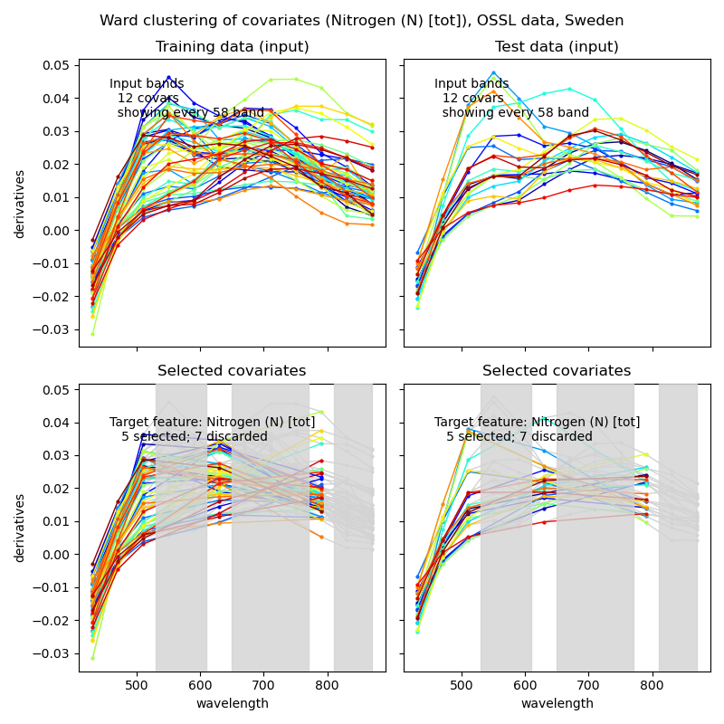
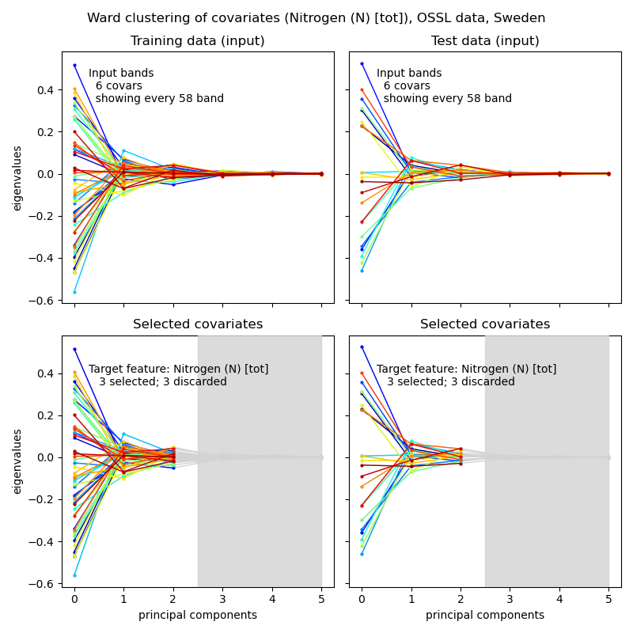
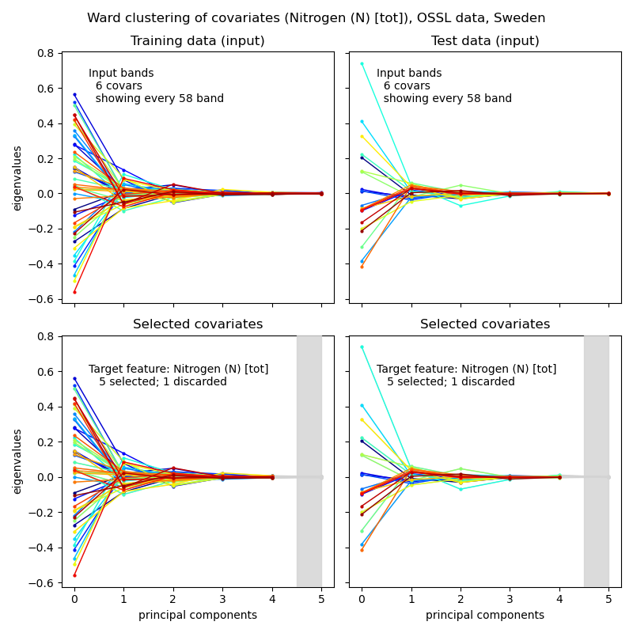

### Process flow - featureAgglomeration

The covariate cluster method (featureAgglomeration) implemented in the process uses a model fit approach that is related to a target feature. The clustering is thus perfomed independently for each target feature and is categorised as a specific feature agglomeration (_specificFeatureAgglomeration_). The position of the process in the chain is indicated in the schematic flow chart below.

```
|____SpectralData
| |____filter
| | |____singlefilter
| | |____multiFilter
| |____dataSetSplit
| | |____spectralInfoEnhancement
| | | |____scatterCorrection
| | | |____standardisation
| | | |____derivatives
| | | |____decompose
| | |____generalFeatureSelection
| | | |____varianceThreshold
| | |____targetFeatureExtract
| | | |____removeOutliers
| | | |____regressorExtract
| | | | |____specificFeatureAgglomeration
| | | | | |____wardClustering
```

### Introduction

Clustering, or agglomerating, covariates that have similar patterns is an alternative route vis-a-vis feature selection for reducing the number of covariates. Sci-kit learn includes a range of [clustering methods](https://scikit-learn.org/stable/modules/classes.html#module-sklearn.cluster) of which the majority operates on the covariates only. In the process flow I have instead included Ward clustering that agglomerates the covariates in relation to the target feature. The implementation in the process flow also  include an optional automation for selecting the most favourable number of clusters.

To invoke Ward clustering (feature specific agglomeration) using a fixed set (5 as it happens) of output clusters, edit the json command file accordingly:


```
"specificFeatureAgglomeration": {
    "apply": true,
    "wardClustering": {
      "apply": true,
      "n_clusters": 5,
      "affinity": "euclidean",
      "tuneWardClustering": {
        "apply": false,
        "kfolds": 3,
        "clusters": [
        ]
      }
    }
  }
```
And to apply the automatic tuning for seeking the most favourable number of clusters:

```
"specificFeatureAgglomeration": {
    "apply": true,
    "wardClustering": {
      "apply": true,
      "n_clusters": 0,
      "affinity": "euclidean",
      "tuneWardClustering": {
        "apply": true,
        "kfolds": 3,
        "clusters": [
        3,
        4,
        5,
        6,
        7
        ]
      }
    }
  }
```

In the last example the tuneWardClustering algorithm compares 3 to 7 clusters using a triple kfold train-test approach for deciding the best option. The latter is always against the specific target feature.

Figure 1 compares the outcomes of clustering of meancentred spectra (top row), the first derivate (middle row) and PCA decompositions (bottom row); the left column shows clustering against a fixed number clusters and the right column against tuned number of clusters. The latter was set so that the tuned numbers was not an endpoint. In all cases total nitrogen [N] was set as the target feature.

<figure class="half">

<a href="../../images/spectromodel_wardcluster_5fixed_spectra-meancenter_N.png"></a>

<a href="../../images/spectromodel_wardcluster_7tuned_spectra-meancenter_N.png"></a>

<a href="../../images/spectromodel_wardcluster_10tuned_derivative-meancenter_N.png"></a>

<a href="../../images/spectromodel_wardcluster_5fixed_derivative-meancenter_N.png"></a>

<a href="../../images/spectromodel_wardcluster_3fixed_pca-spectra-meancenter_N.png"></a>

<a href="../../images/spectromodel_wardcluster_5tuned_pca-spectra-meancenter_N.png"></a>

<figcaption>Figure 1. Ward clustering of covariates; From top to bottom the rows show clustering of meancentred spectral signals (top), clustering of derivatives (middle) and clustering after PCA decompositions (bottom); the left columns show clustering with a fixed number of output clusters and the right columns after applying a tuning for deciding the optimal number of clusters.
</figcaption>
</figure>
